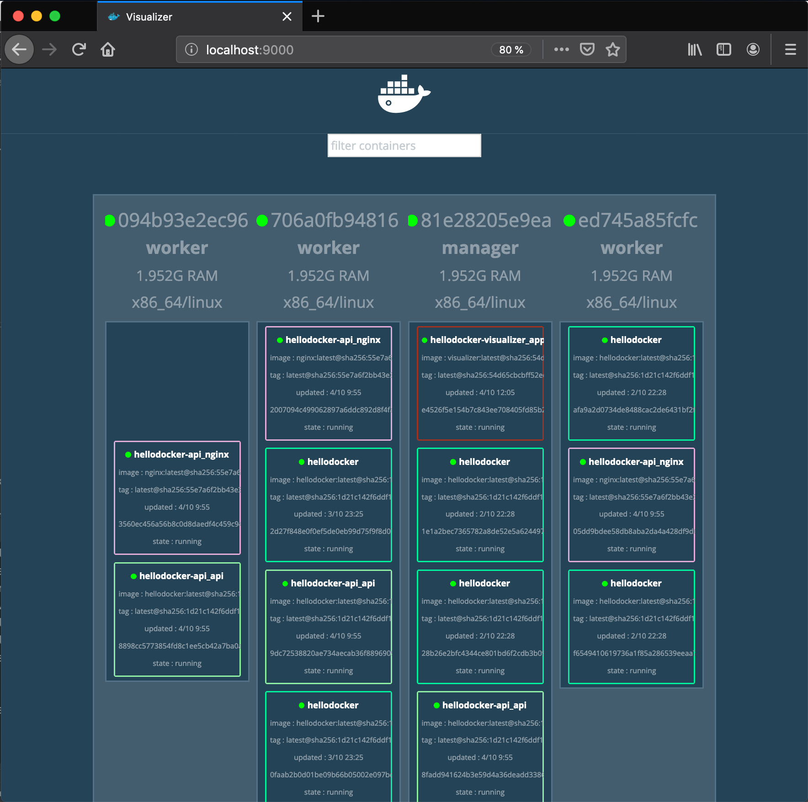

## 4. Docker Swarm


### 4-1. What is Docker Swarm?
  1) a Clustering and Scheduling Tool for Docker Containers
  2) 여러 Docker Host를 Cluster로 묶어주는 Container Ochestration Tool
  3) Embeded in Docker


### 4-2. Compose vs Swarm vs Service vs Stack
  1) Compose : 다수 컨터이너를 관리를 위해 하나로 묶고 관리하는 단위 또는 관리툴(보통, 컴포즈는 다수 컨테이너가 단일 호스트에서 실행)
  2) Swarm   : 스웜 (클러스터)라 부르듯 다수의 컨테이너를 묶어 클러스터를 구축하고 스케줄링과 같은 관리용도로 쓰인다(툭히, 다수의 컨테이너가 다수의 호스트에서 연동되는 개념이 컴포즈와는 구분)
  3) Service : Service in Swarm Cluster, a Set of One Container More (주로 개별적 이미지가 서비스라는 개념으로 제어(분산, 스케일인아웃, 실행제약)된다.)
  4) Stack   : Manage Application Grouped Swarm's Services (서비스의 상위 개념으로 서비스의 그룹핑 단위이다. 스웜 클러스터 안의 컴포즈라 볼 수 있다. 그리고 컴포즈의 개별 컨테이너는 서비스가 된다. 그래서 서비스의 상위 개념이다.)


### 4-3. __practice01: Swarm Cluster 구성해 보기__

#### 1. __여러 대의 도커 호스트에 실행되는 컨테이너 구성__
  1) DIND(Docker in Docker) 를 사용해 여러 호스트내의 도커 컨테이너 구성
  2) 컨테이너 종류
     + registry(1) : 도커 레지스트리 역활 (도커인 도커에서 도케 호스트안의 도커는 도커 허브에서 이미지를 다운로드 할 수 없다. 일종의 inhouse registry)
     + manager(1) : Swarm Cluster 전체를 제어하는 역할
     + worker(3) : 실제 서비스 이미지를 실행하는 컨테이너를 구동하는 도커 호스트다.
  3) docker-compose.yml 작성
     ```yaml
     version: "3"
     services:
       hellodocker-registry:
         container_name: hellodocker-registry
         image: registry:2.6
         ports:
           - 5000:5000
         volumes:
           - "./registry-data:/var/lib/registry"
    
       hellodocker-manager:
         container_name: hellodocker-manager
         image: docker:18.05.0-ce-dind
         privileged: true
         tty: true
         ports:
           - 8000:80
           - 9000:9000
         depends_on:
           - hellodocker-registry
         expose:
           - 3375
         command: "--insecure-registry hellodocker-registry:5000"
         volumes:
           - "./stack:/stack"
    
       hellodocker-worker01:
         container_name: hellodocker-worker01
         image: docker:18.05.0-ce-dind
         privileged: true
         tty: true
         depends_on:
           - hellodocker-manager
           - hellodocker-registry
         expose:
           - 7946
           - 7946/udp
           - 4789/udp
         command: "--insecure-registry hellodocker-registry:5000"
    
       hellodocker-worker02:
         container_name: hellodocker-worker02
         image: docker:18.05.0-ce-dind
         privileged: true
         tty: true
         depends_on:
           - hellodocker-manager
           - hellodocker-registry
         expose:
           - 7946
           - 7946/udp
           - 4789/udp
         command: "--insecure-registry hellodocker-registry:5000"
    
       hellodocker-worker03:
         container_name: hellodocker-worker03
         image: docker:18.05.0-ce-dind
         privileged: true
         tty: true
         depends_on:
           - hellodocker-manager
           - hellodocker-registry
         expose:
           - 7946
           - 7946/udp
           - 4789/udp
         command: "--insecure-registry hellodocker-registry:5000"
     ```
     + 도커 레지스트리 접근은 https -> http 로 바꾸기 위해 --insecure-registry 옵션을 사용했다.
      
  4) compose 실행
     ```bash
     $ docker-compose up -d
     ```
  5) verify
     ```bash
     $ docker container ls
     CONTAINER ID  IMAGE                    STATUS        PORTS                                       NAMES
     717c3bd59b6e  docker:18.05.0-ce-dind   Up 2 minutes  2375/tcp, 4789/udp, 7946/tcp, 7946/udp      hellodocker-worker01
     4c08452c11fb  docker:18.05.0-ce-dind   Up 2 minutes  2375/tcp, 4789/udp, 7946/tcp, 7946/udp      hellodocker-worker03
     1c3bb264420f  docker:18.05.0-ce-dind   Up 2 minutes  2375/tcp, 4789/udp, 7946/tcp, 7946/udp      hellodocker-worker02
     a21626a9507d  docker:18.05.0-ce-dind   Up 2 minutes  2375/tcp, 3375/tcp, 0.0.0.0:9000->9000/tcp, hellodocker-manager
                                                          0.0.0.0:8000->80/tcp  
     ca2805bfd7ca  registry:2.6             Up 2 minutes  0.0.0.0:5000->5000/tcp                      hellodocker-registry
     
     ```
  6) Activate Swarm Mode
     manager 호스트 marking 작업을 통해 swarm 모드가 활성화 된다.  
     ```bash
     $ docker container exec -it hellodocker-manager sh
     / # docker swarm init
     Swarm initialized: current node (abssnhoxe924c82u4rw0ngiz7) is now a manager.

     To add a worker to this swarm, run the following command:

          docker swarm join --token SWMTKN-1-5dwkn4saljbvc9nmdyn74wet1othsuyj9loyq8om6b4grx6gpw-a2b8rdxgcqjk86uw8kfqlfq0b 172.22.0.3:2377

     To add a manager to this swarm, run 'docker swarm join-token manager' and follow the instructions.

     / # exit     
     ```
     + 출력에 join token 확인할 것(Cluster 구성에 Worker Continer를 참여 시키기 위해 반드시 필요)
     
  7) Join Worker Container in Swarm Cluster
     Worker Container에서 Manager Container에 Token 전송한다
     
     ```bash
     $ docker container exec -it hellodocker-worker01 sh
     / # docker swarm join --token SWMTKN-1-5dwkn4saljbvc9nmdyn74wet1othsuyj9loyq8om6b4grx6gpw-a2b8rdxgcqjk86uw8kfqlfq0b hellodocker-manager:2377
     This node joined a swarm as a worker.
     / # exit
     ```

     ```bash
     $ docker container exec -it hellodocker-worker02 sh
     / # docker swarm join --token SWMTKN-1-5dwkn4saljbvc9nmdyn74wet1othsuyj9loyq8om6b4grx6gpw-a2b8rdxgcqjk86uw8kfqlfq0b hellodocker-manager:2377
     This node joined a swarm as a worker.
     / # exit
     ```

     ```bash
     $ docker container exec -it hellodocker-worker03 sh
     / # docker swarm join --token SWMTKN-1-5dwkn4saljbvc9nmdyn74wet1othsuyj9loyq8om6b4grx6gpw-a2b8rdxgcqjk86uw8kfqlfq0b hellodocker-manager:2377
     This node joined a swarm as a worker.
     / # exit
     ```
  8) Verify 'hellodocker-swarm' Swarm Cluster   
     ```bash
     $ docker container exec -it hellodocker-manager sh
     / # docker node ls
     ID                            HOSTNAME       STATUS   AVAILABILITY  MANAGER STATUS  ENGINE VERSION
     ndirb43uj2qwwflgpzakf4oa9     1c3bb264420f   Ready    Active                        18.05.0-ce
     neqc8fm3bt67l2gb51dpzne0x     4c08452c11fb   Ready    Active                        18.05.0-ce
     16dpy0tj2fn2ywojrnm13sweo     717c3bd59b6e   Ready    Active                        18.05.0-ce
     abssnhoxe924c82u4rw0ngiz7 *   a21626a9507d   Ready    Active        Leader          18.05.0-ce
     / # exit
     ```
  9) Register Image into Docker Registry (Operating Private Registry)
     태그 붙이기   
     ```bash
     $ docker image tag kickscar/hellodocker:latest localhost:5000/kickscar/hellodocker:latest
     ```
     
     등록하기
     ```bash
     $ docker image push localhost:5000/kickscar/hellodocker:latest
     ```
 10) Downloading Image registered in Worker Host (Operating Private Registry)  
      
     Worker01 Host Container  
     
     ```bash
     $ docker container exec -it hellodocker-worker01 sh
     / # docker image pull hellodocker-registry:5000/kickscar/hellodocker:latest
     latest: Pulling from kickscar/hellodocker
     e7c96db7181b: Pull complete 
     50958466d97a: Pull complete 
     56174ae7ed1d: Pull complete 
     284842a36c0d: Pull complete 
     83cf8dfbb24f: Pull complete 
     15c6e96168ae: Pull complete 
     Digest: sha256:1d21c142f6ddf12db08e37be0cbd5b1d029e141f3d6efe4fc2a008548ecec302
     Status: Downloaded newer image for hellodocker-registry:5000/kickscar/hellodocker:latest
     / # exit
     ```      
  
     Worker02 Host Container  
      
     ```bash
     $ docker container exec -it hellodocker-worker02 sh
     / # docker image pull hellodocker-registry:5000/kickscar/hellodocker:latest
     latest: Pulling from kickscar/hellodocker
     Digest: sha256:1d21c142f6ddf12db08e37be0cbd5b1d029e141f3d6efe4fc2a008548ecec302
     Status: Downloaded newer image for hellodocker-registry:5000/kickscar/hellodocker:latest
     / # exit
     ```      
      
     Worker03 Host Container  
      
     ```bash
     $ docker container exec -it hellodocker-worker03 sh
     / # docker image pull hellodocker-registry:5000/kickscar/hellodocker:latest
     latest: Pulling from kickscar/hellodocker
     Digest: sha256:1d21c142f6ddf12db08e37be0cbd5b1d029e141f3d6efe4fc2a008548ecec302
     Status: Downloaded newer image for hellodocker-registry:5000/kickscar/hellodocker:latest
     / # docker image ls
     REPOSITORY                                       TAG      IMAGE ID       CREATED        SIZE
     hellodocker-registry:5000/kickscar/hellodocker   latest   ea9c0fcdd86b   4 days ago     76.4MB
     / # exit
     ```      
#### 2. __Swarm Cluster에 Service 배포하기__
 
  1) Docker Service란?  
     + 애플리케이션을 구성하는 (일부 컨테이너를 제어)하기 위한 단위
     + 복제(replica) 개념 확실히!
     
  2) 서비스 생성 및 배포(실행)
     ```bash
     $ docker container exec -it hellodocker-manager sh
     / # docker service create --replicas 1 --publish 8000:8080 --name hellodocker hellodocker-registry:5000/kickscar/hellodocker
     1/1: running   [==================================================>] 
     verify: Service converged 
     / # docker service ls
     ID            NAME          MODE          REPLICAS     IMAGE                                                   PORTS
     gkqfr3aque64  hellodocker   replicated    1/1          hellodocker-registry:5000/kickscar/hellodocker:latest   *:8000->8080/tcp
     
     ```
  3) Scale Out
  
     ```bash
     $ docker container exec -it hellodocker-manager sh
     / # docker service scale hellodocker=6
     hellodocker scaled to 6
     overall progress: 6 out of 6 tasks 
     1/6: running   [==================================================>] 
     2/6: running   [==================================================>] 
     3/6: running   [==================================================>] 
     4/6: running   [==================================================>] 
     5/6: running   [==================================================>] 
     6/6: running   [==================================================>] 
     verify: Service converged 
     ```

  3) 노드 분산 배치 확인하기
     ```bash
     $ docker container exec -it hellodocker-manager sh
     / # docker service ps hellodocker
     ID                  NAME                IMAGE                                                   NODE                DESIRED STATE       CURRENT STATE                ERROR               PORTS
     paox1l3u1y8r        hellodocker.1       hellodocker-registry:5000/kickscar/hellodocker:latest   a21626a9507d        Running             Running 7 minutes ago                            
     jwqkc97mghmb        hellodocker.2       hellodocker-registry:5000/kickscar/hellodocker:latest   1c3bb264420f        Running             Running about a minute ago                       
     h9mvf2ma38mo        hellodocker.3       hellodocker-registry:5000/kickscar/hellodocker:latest   717c3bd59b6e        Running             Running about a minute ago                       
     vr3ubull2a8q        hellodocker.4       hellodocker-registry:5000/kickscar/hellodocker:latest   717c3bd59b6e        Running             Running about a minute ago                       
     y3ek5dzqhk30        hellodocker.5       hellodocker-registry:5000/kickscar/hellodocker:latest   a21626a9507d        Running             Running about a minute ago                       
     d7bggjwlxbae        hellodocker.6       hellodocker-registry:5000/kickscar/hellodocker:latest   4c08452c11fb        Running             Running about a minute ago                       
     / # 
     ```
  4) 서비스 제거
     ```bash
     $ docker container exec -it hellodocker-manager sh
     / # docker service rm hellodocker
     / # 
     ```


#### 3. __Swarm Cluster에 Stack 배포하기__
  
  1) Docker Stack이란?
     + 하나 이상의 (*서비스를 그룹*)으로 묶는 단위
     + (*서비스 상위개념*)으로 (서비스를 그룹)화 하여 애플리게이션을 구성하게 된다.
     + (*서비스를 그룹화*)하기 때문에 스케일 인아웃, 실행제약조건을 가하는 것이 가능한 (*스웜에서 동작하는 컴포즈*)다.
     + (*서비스 그룹*)은 (*Overlay Network*)에 포함되어야 통신이 가능하다. (당연한 거 아님??)
  
  2) Overlay Network 생성
     ```bash
     $ docker container exec -it hellodocker-manager sh
     / # docker network create --driver=overlay --attachable hellodocker-network
     6ponqn3rtzvf58iq3uqykc9rq
     / # 
     ```

  3) Register nginix Image into Private Docker Registry  
     태그 붙이기   
     ```bash
     $ docker image tag kickscar/nginx:latest localhost:5000/kickscar/nginx:latest
     ```
     
     등록하기
     ```bash
     $ docker image push localhost:5000/kickscar/nginx:latest
     ```
    
  4) Stack Confguration 
     
     stack 설정파일: .stack/hellodocker-stack.yml  
  
     ```yaml
     version: "3"
     services:
       nginx:
         image: hellodocker-registry:5000/kickscar/nginx:latest
         deploy:
           replicas: 3
           placement:
             constraints: [node.role != hellodocker-manager]
         environment:
           BACKEND_HOST: hellodocker-api:3000
         depends_on:
           - api
         networks:
           - hellodocker-network
       api:
         image: hellodocker-registry:5000/kickscar/hellodocker:latest
         deploy:
           replicas: 3
           placement:
             constraints: [node.role != hellodocker-manager]
         networks:
           - hellodocker-network
     
     networks:
       hellodocker-network:
         external: true    
     
     ```
     
  5) Deploy Stack
     ```bash
     $ docker container exec -it hellodocker-manager sh
     / # docker stack deploy -c /stack/hellodocker-stack.yml hellodocker-api
     Creating service hellodocker-api_nginx
     Creating service hellodocker-api_api 
     ```
  
  6) Verify Stack Deployed
     ```bash
     $ docker container exec -it hellodocker-manager sh
     / # docker stack services hellodocker-api
     ID                  NAME                    MODE         REPLICAS    IMAGE                                                  PORTS
     mhapt5e48h69        hellodocker-api_nginx   replicated   3/3         hellodocker-registry:5000/kickscar/nginx:latest                          
     q5waxbc9l6g3        hellodocker-api_api     replicated   3/3         hellodocker-registry:5000/kickscar/hellodocker:latest   
     / # 
  
  7) Verify Container in Stack Deployed
     ```bash
     $ docker container exec -it hellodocker-manager sh
     / # docker stack ps hellodocker-api
     ID                  NAME                      IMAGE                                                   NODE                DESIRED STATE       CURRENT STATE                  ERROR                              PORTS
     4s4v587zc143        hellodocker-api_api.1     hellodocker-registry:5000/kickscar/hellodocker:latest   094b93e2ec96        Running             Running 24 minutes ago                       
     8fe89ehcwldt        hellodocker-api_nginx.1   hellodocker-registry:5000/kickscar/nginx:latest         ed745a85fcfc        Running             Running 24 minutes ago                       
     364asiqyry1o        hellodocker-api_api.2     hellodocker-registry:5000/kickscar/hellodocker:latest   81e28205e9ea        Running             Running 24 minutes ago                       
     7kk1crnhl72s        hellodocker-api_nginx.2   hellodocker-registry:5000/kickscar/nginx:latest         094b93e2ec96        Running             Running 24 minutes ago                       
     jt4au3zq7euy        hellodocker-api_api.3     hellodocker-registry:5000/kickscar/hellodocker:latest   706a0fb94816        Running             Running 24 minutes ago                       
     v5hwb7l66rpt        hellodocker-api_nginx.3   hellodocker-registry:5000/kickscar/nginx:latest         706a0fb94816        Running             Running 24 minutes ago                       
     / #
     ```
     
     
#### 4. __Visualize Deployment of Containers in Swarm Cluster__
  
  1) Visualizer Application  
     시각화 툴로, 스웜 클러스터내의 각 노드별 컨테이너 배치현황을 시각화한다.  

  2) .stack/visualizer.yml 작성
  
     ```yaml
     version: "3"
      
     services:
       app:
         image: hellodocker-registry:5000/kickscar/visualizer:latest
         ports:
           - "9000:8080"
         volumes:
           - /var/run/docker/sock:/var/run/docker.sock
         deploy:
           mode: global
           placement:
             constraints: [node.role == manager]     
     ```
     + mode: global -> visuallizer clinet 컨테이너를 스웜 클러이상의 모든 노드에 배치 시킨다.
     + node.role == manager -> manager 노드에 웹 서비스가 가능한 컨테이너를 배치 시킨다.
     + 접근포트(포트포워딩)
       ```  
       ( host   ->   manager in host )  :  ( manager in host   ->   visualizer )   
       ( 9000   ->         9000      )  :  (       9000        ->       8080   ) 
       ```
          
  3) visualizer 이미지 Private Docker Registry 에 등록하기  
     이미지 풀링
     ```bash
     $ docker image pull dockersamples/visualizer
     Using default tag: latest
     latest: Pulling from dockersamples/visualizer
     ```
       
     태그 붙이기   
     ```bash
     $ docker image tag dockersamples/visualizer:latest localhost:5000/kickscar/visualizer:latest
     ```
     
     등록하기
     ```bash
     $ docker image push localhost:5000/kickscar/visualizer:latest
     ```
  
  4) 스택에 배포하기
     ```bash
     $ docker container exec -it hellodocker-manager sh
     / # docker stack deploy -c /stack/visualizer.yml hellodocker-visualizer
     Creating network hellodocker-visualizer_default
     Creating service hellodocker-visualizer_app
     / # 
     ```
 
  5) 배포 확인
     ```bash
     $ docker container exec -it hellodocker-manager sh
     / # docker stack ps hellodocker-visualizer
     ID            NAME                                                   IMAGE                                                  NODE                DESIRED STATE       CURRENT STATE             ERROR               PORTS
     xgis5osek1sh  hellodocker-visualizer_app.r5wwz0d1mzlzsvb2d1l0hx2gg   hellodocker-registry:5000/kickscar/visualizer:latest   81e28205e9ea        Running             Starting 13 seconds ago      
     / # 
     ```
  6) 브라우저로 확인 (http://localhost:9000)
  
     

 
  
#### 5. __HAProxy, Ingress and Load Balancer for Docker Swarm Cluster__ 
  
  1) HAProxy
     + 외부에 여러 노드에 분산되어 실행중인 컨터이너의 서비스를 외부에 노출(Ingress)
     + 서비스(컨테이너)가 배치된 노드의 부하 분산(Load Balancer)
  
  2) .stack/ingress.yml 작성
  
     ```yaml
     version: "3"
    
     services:
       haproxy:
         image: hellodocker-registry:5000/kickscar/haproxy
         networks:
           - hellodocker-network
         volumes:
           - /var/run/docker.sock:/var/run/docker.sock
         deploy:
           mode: global
           placement:
             constraints:
               - node.role == manager
         ports:
           - 80:80
           - 1936:1936
    
     networks:
       hellodocker-network:
         external: true
     ```

  3) .stack/hellodocker-stack.yml 수정 및 재배포
  
     ```yaml
     version: "3"
     services:
       nginx:
         image: hellodocker-registry:5000/kickscar/nginx:latest
         deploy:
           replicas: 3
           placement:
             constraints: [node.role != hellodocker-manager]
         environment:
           SERVICE_PORT: 80
           BACKEND_HOST: hellodocker-api:3000
         depends_on:
           - api
         networks:
           - hellodocker-network
       api:
         image: hellodocker-registry:5000/kickscar/hellodocker:latest
         deploy:
           replicas: 3
           placement:
             constraints: [node.role != hellodocker-manager]
         networks:
           - hellodocker-network
     
     networks:
       hellodocker-network:
         external: true    
     
     ```
     + HAProxy가 서비스를 찾기 위해 nginx 환경변수에 SERVICE_PORT 추가
     + 설정이 변경 되었기 때문에 재배포
       
       ```bash
       $ docker container exec -it hellodocker-manager sh
       / # docker stack deploy -c /stack/hellodocker-stack.yml hellodocker-api
       Updating service hellodocker-api_nginx (id: hjzhqfqd0aypsbbcn5xfef9aq)
       Updating service hellodocker-api_api (id: qyxw1h7go1kvqst864rs60vwi)
       / # 
       ```
       + 서비스가 존재하고 설정만 변경되었기 때문에 "Updating service 서비스명" 만 출력
  
  4) HAProxy 이미지 Private Docker Registry 에 등록하기
  
       이미지 풀링
       ```bash
       $ docker image pull dockercloud/haproxy
       Using default tag: latest
       latest: Pulling from dockercloud/haproxy
       ```
         
       태그 붙이기   
       ```bash
       $ docker image tag dockercloud/haproxy:latest localhost:5000/kickscar/haproxy:latest
       ```
       
       등록하기
       ```bash
       $ docker image push localhost:5000/kickscar/haproxy:latest
       ```
  5) Ingress 배포
     ```bash
     $ docker container exec -it hellodocker-manager sh
     / # docker stack deploy -c /stack/ingress.yml hellodocker-ingress
     Creating service hellodocker-ingress_haproxy
     / # 
     ```
  6) Ingress 배포 확인
     ```bash
     $ docker container exec -it hellodocker-manager sh
     / # docker service ls
     ID                  NAME                          IMAGE                                                   PORTS
     l47bjbvpnyhb        hellodocker                   hellodocker-registry:5000/kickscar/hellodocker:latest   *:8000->8080/tcp
     qyxw1h7go1kv        hellodocker-api_api           hellodocker-registry:5000/kickscar/hellodocker:latest   
     hjzhqfqd0ayp        hellodocker-api_nginx         hellodocker-registry:5000/kickscar/nginx:latest         
     nhkffpg7p66z        hellodocker-ingress_haproxy   hellodocker-registry:5000/kickscar/haproxy:latest       *:80->80/tcp, *:1936->1936/tcp
     o5f13y5aopkw        hellodocker-visualizer_app    hellodocker-registry:5000/kickscar/visualizer:latest    *:9000->8080/tcp
     / # 
     ```
     + 각 컨테이너 이미지의 Ports 확인 해 보고 반드시 이해 할 것!
  
  7) Ingress 서비스 접근
     ```bash
     $ curl http://localhost:8000
     Hello Docker
     $
     ```
       
#### 6. __스웜 클러스터 구성 및 관리(정리해보기)__          