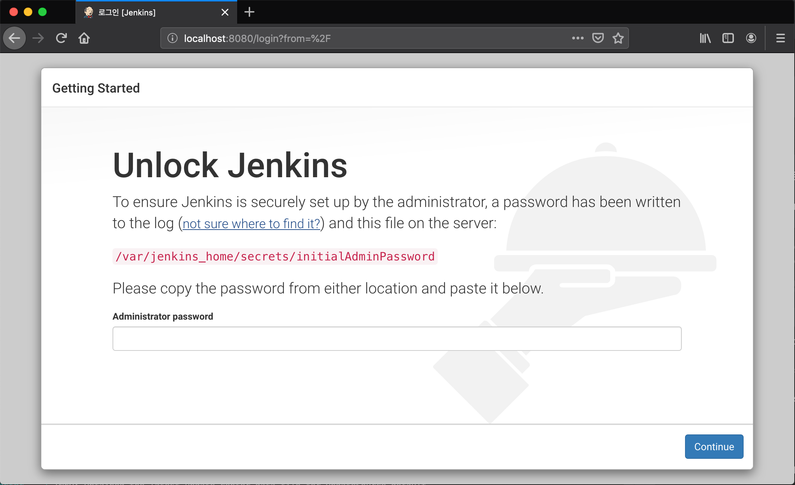
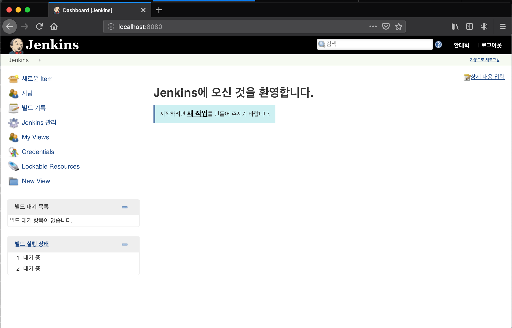

## 4. Docker Compose


### 4-1. What is Docker Compose?
  1) 여러 컨테이너들의 실행을 한번에 관리해주는 Docker Management Tool
  2) Fig라는 이름으로 개발된 관리 도구
  3) 보통 시스템은 여러 컨테이너들 간에 서로 통신과 연동으로 구축된다.

#### 1. __practice01: Docker Compose 명령으로 여러 컨테이너 실행__
  1) Create Directory /docker-practices/docker-basics/hellodocker-compose
  2) Write docker-compose.yml
     ```yml
     version: "3"
     services:
        hellodocker:
           image: kickscar/hellodocker
           ports:
              - 3030:3000     
     ```
  3) Run Containers
     ```bash
     docker-compose up -d
     ``` 
     
     -d : daemon(background) 실행
  4) Verify
     ```bash
     docker container ls
     ```
  5) Test
     ```bash
     curl 'http://localhost:3030'
     ```
  6) Stop all Containers
     ```bash
     $ docker-compose [start|stop|restart]
     $ docker conatiner l -a
     ```
  7) Start or Stop or Restart all Container
     ```bash
     $ docker-compose [start|stop|restart]
     $ docker conatiner l -a
     ```
     
#### 2. __practice02: 이미지 빌드와 함께 여러 컨테이너 실행__
  1) Create Directory /docker-practices/docker-basics/hellodocker-compose-build
  2) Dockerfile, server.js exists in Directory
  2) Write docker-compose.yml
     ```yml
     version: "3"
     services:
        hellodocker:
           build: .
           ports:
              - 3030:3000     
     ```
  3) Run Containers
     ```bash
     docker-compose up -d --build
     ``` 
     -d : daemon(background) 실행  
     --build : 강제 빌드(forced)
  4) Verify
     ```bash
     docker container ls
     ```
  5) Test
     ```bash
     curl 'http://localhost:3030'
     ```


### 4-2. 2개 젠킨스(Master + Slave) 컨테이너 실행하기

#### 1. __practice01: Jenkins Master Node Container 실행__
  1) Create Directory /docker-practices/docker-basics/jenkins-master-node
  2) Write docker-compose.yml
     ```yml
     version: "3"
     services:
        jenkins-master:
           container_name: jenkins-master
           image: jenkins/jenkins
           ports:
              - 8080:8080
           volumes:
              - ./jenkins_home:/var/jenkins_home
     ```
     volumes :
     호스트 파일 시스템의 파일 또는 폴더를 컨테이너와 공유한다.
     
  3) Run Containers
     ```bash
     docker-compose up
     ``` 
     foreground 으로 실행시켜 초기 비밀번호 꼭 복사

     ```yml
     jenkins-master    | Jenkins initial setup is required. An admin user has been created and a password generated.
     jenkins-master    | Please use the following password to proceed to installation:
     jenkins-master    | 
     jenkins-master    | 7a2de9045ab4448bbc796f0110635841
     jenkins-master    | 
     jenkins-master    | This may also be found at: /var/jenkins_home/secrets/initialAdminPassword

     ```     
  4) Verify
     ```bash
     docker container ls
     ```
  5) Test  
     브라우저로 접근: http://localhost:8080 
     
     
     
     Volume 디렉토리 ./jenkins_home 젠킨스 홈 확인할 것.
     
     
#### 2. __practice02: Jenkins Master/Slave Node 2개 Containers 동시 실행